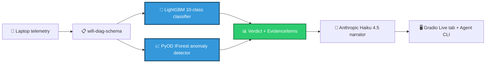

<!-- ABOVE_THE_FOLD_START — DO NOT EDIT WITHOUT UPDATING ALL 3 REPOS (Plan 05-06 byte-equal gate) -->
# AI Internet Diagnostic

> Tells you the *specific* reason your Wi-Fi just dropped — evidence-grounded, confidence-scored attribution like _"your school's 802.1X session expired at 09:14:23 — here are the three telemetry signals that prove it."_

## Results

**Macro F1:** 0.974 (synthetic) · pending (real, Reality Anchor dogfood) · ECE 0.28

## Architecture

Mermaid source (renders on GitHub)

_Trained models (blue) sit at the visual gravity center of the pipeline. The LLM narrator (green) is downstream — it explains what the classifier and anomaly detector found, with citations to specific telemetry fields. This is **not** a GPT wrapper._

## Try it live

🔗 **[Live demo on Hugging Face Spaces](https://huggingface.co/spaces/WolfDavid/wifi-diag)**

---

<!-- ABOVE_THE_FOLD_END -->
# AI Internet Diagnostic — Agent

Cross-platform local agent (Windows / macOS / Linux) that collects enterprise-Wi-Fi telemetry and either runs full local diagnosis (no network egress — privacy-by-default) or streams `TelemetryFrame`s to the [Hugging Face Space](https://huggingface.co/spaces/WolfDavid/ai-internet-diagnostic) for live diagnosis.

**Phase 1 status:** Skeleton only. Per-OS collectors land in Phase 4; agent ↔ Space SSE transport in Phase 5.

## Pin posture

- `wifi-diag-schema>=1.0.0,<2.0.0` (D-13) — `[tool.uv.sources]` defaults to sibling-source path during local dev; CI swaps to PyPI install once published.
- Python 3.13 (D-15).
- Per-OS extras: `pip install ai-internet-diagnostic-agent[windows]` / `[macos]` / `[linux]` — currently empty placeholders, populated in Phase 4.

## HF mirror status

Per CONTEXT D-11: agent's HF Hub mirror is deferred. Install path is GitHub-driven; no `release.yml` ships in Phase 1. Phase 4 plan 04-* will add an HF mirror once the agent has installable per-OS collectors that benefit from a discoverable HF surface.

## Supported platforms

| OS | Status | Notes |
|---|---|---|
| Windows 10 / 11 (incl. 24H2) | **Primary** (dogfood) | `pip install ai-internet-diagnostic-agent[windows]` — pulls `pywin32`. WLAN-AutoConfig event log readable without admin. |
| macOS Sonoma 14.4+ / Sequoia 15+ | Secondary | `pip install ai-internet-diagnostic-agent[macos]` — pulls `pyobjc-framework-CoreWLAN`. **Note:** ad-hoc-signed Python returns `None` for BSSID/SSID; agent runs in degraded mode. `agent doctor` will warn. |
| Linux + NetworkManager | Tertiary | `pip install ai-internet-diagnostic-agent[linux]` — pulls `dbus-next`. |

### Linux supported-distro list (v1)

Tested with NetworkManager + systemd:

- Ubuntu 22.04 LTS / 24.04 LTS
- Fedora 38+
- Pop!_OS 22.04+
- Linux Mint 21+
- Arch Linux with the `NetworkManager` package

Unsupported at v1 (the agent falls back to baseline-only — `psutil` + `icmplib` still work, so the daemon still produces valid `TelemetryFrame`s with `auth_event_class="none"`):

- Arch Linux with `iwd` (no NetworkManager)
- Distros using `systemd-networkd` standalone
- Alpine / Void without NM

`agent doctor` reports per-OS status; the agent never crashes on an unsupported stack — it just falls back to baseline-only telemetry collection (Pitfall 12 mitigation made structural).

## Privacy

The schema field allowlist on `TelemetryFrame` IS the privacy contract — written from the schema, not aspirationally. The privacy contract is enforced structurally by the `wifi_diag_schema.TelemetryFrame` model with `extra="forbid"`. The CI gate `tests/test_redaction_roundtrip.py` (hypothesis property test, 200 examples × 5 adversarial PII templates) fails the build on any PII leak.

See [PRIVACY.md](PRIVACY.md) for full data-flow documentation. `agent privacy` prints the same content plus the user's effective configuration (default consent, model revision pin, retention days).

## Try it on a real network

1. `pip install ai-internet-diagnostic-agent[<your-os>]` (windows / macos / linux extras)
2. `agent start` — launches the background daemon
3. After your next disconnect: `agent diagnose` — prints a verdict locally (default consent: Local — nothing leaves your laptop)
4. `agent stop` — terminates the daemon

Cloud-share consent options are visibly disabled in v1 (Phase 4) and labeled `[Phase 5]`. Phase 5 wires the live SSE transport to the [WolfDavid/wifi-diag](https://huggingface.co/spaces/WolfDavid/wifi-diag) Space.

## License

Apache-2.0.
